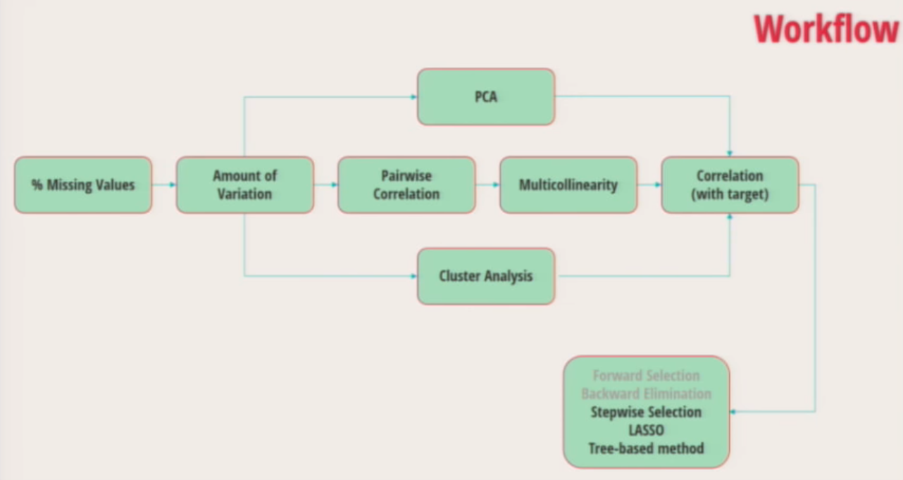

# dimensionality_reduction_PyData_2016
This talk provides a step-by-step overview and demonstration of several dimensionality (feature) reduction techniques.

* https://www.youtube.com/watch?v=ioXKxulmwVQ link of the video on dimensionality reduction
* https://scikit-learn.org/stable/modules/feature_selection.html feature selection in sklearn

## Why perform dimensionality reduction?
* with a fixed number of training samples, the predictive power reduces as the dimensionality increases.
* trade-off between predictive power and model interpretability.
* Law of Parsimony: simpler explanations are generally better than complex ones.
* prevent overfitting.
* lower execution time.

## Dimensionality reduction techniques:
1. Percent missing values
2. Amount of variation
3. Pairwise correlation
4. Multicollinearity
5. Principal Component Analysis (PCA)
6. Cluster analysis
7. Correlation with the target
8. Forward selection
9. Backward elimination (RFE)
10. Stepwise selection
11. LASSO
12. Tree-based selection



### 1. Percent missing values
A very simple approach, drop variables that have a high % of missing values. Missing values can have meaning, therefore create binary indicators to denote missing (or non-missing) values.
General rules of thumb:
* of more than 95% missing value, discard feature.
* if more than 50% missing value, do not impute, provide binary indicators.
* if less than 50% missing value, perform imputation.
Easy to do in pandas: 
```python
import pandas as pd
desc = X.describe().T

#  percent missing
desc['missing %'] = 1 - (desc['count'] / len(X))
```
### 2. Amount of variation
Another simple approach, drop variables that have a very low variation.
* either standardize all variables, or use standard deviation to account for variables with different scales.
* discard features with 0 variation.

### 3. Pairwise correlation
* Many variables are correlated with each other, and hence are redundant.
* If two variables are highly correlated, keep the one with the higher correlation coefficient with the target.
```python
# 1. correlation matrix for all independent variables, select per example > 0.65
corrMatrix =  X.corr()

# 2. discard variables with weaker correlation with the target
absCorrWithDep = []
for var in allVars:
absCorrWithDep.append(abs(y.corr(X[var])))
```
Automated script so that you don't have to manually search the correlation matrix and table:
```python
# for each column in the correlation matrix
for col in corrMatrix:
    if col in corrMatrix.keys():
        thisCol = []
        thisVars = []
        
        # Store the corr with the dependent variable for fields that are highly correlation with each other
        for i in range(len(corrMatrix)):
        
            if abs(corrMatrix[col][i]) == 1.0 and col <> corrMatrix.keys()[i]:
                thisCorr = 0
            else:
                thisCorr = (1 if abs(corrMatrix[col][i] > corrTol else -1) * abs(temp[corrMatrix.keys()[i]])  
            thisCol.append(thisCorr)
            thisVars.append(corrMatrix.keys()[i])
        mask = np.ones(len(thisCol), dtype = bool) # initialize mask
        
        ctDelCol = 0 # to keep track of the number of columns deleted
        
        for n, j in enumerate(thisCol)
            # delete if (a) a variable is correlated with others and do not have the best corr with the dependent variable
            # or (b) completely corr with the 'col'
            mask[n] = not (j != max(thisCol) and j >= 0)
            
            if j != max(thisCol) and j >= 0)
                # delete the column from corr matrix
                corrMatrix.pop('%s' %thisVars[n])
                temp.pop('%s %thisVars[n])
                ctDelCol = ctDelCol +1
                
         # delete the corresponding rows from the corr matrix
         corrMatrix = corrMatrix[mask]       
```
### 4. Multicollinearity
When two or more variables are highly correlated with each other. Dropping on ore more variable should help reduce dimensionality without a substantial loss of information. Which variables to drop? Use the condition index.
```python
ct = len(corrMatrix)

if ct > minVarsKeep:

    print '\n' + 'performing multicollinearity analysis'
    while True:
        ct = ct - 1
        cols = corrMatrix.keys() # update the list of columns
        w, v = np.linalg.eig(corrMatrix) # eigen values and vectors
        w1 = (max(w) / w) ** 0.5
        
        # if the condition index <= 30 then multicollinearity is not a problem
        if max(w1) <= conIndexTol or ct == minVarsKeep:
            break
        
        for i, val in enumerate(w):
            if val == min(w): # min value, close to zero
                for j, vec in enumerate(v[:, i]): # look into that vector
                    if abs(vec) == max(abs((v[:, i]))):
                        mask = np.ones(len(corrMatrix), dtype = bool) # init
                        for n, col in enumerate(corrMatrix.keys()):
                            mask[n] = n != j
                        # delete row
                        corrMatrix = corrMatrix[mask]
                        # delete column
                        corrMatrix.pop(cols[j])   
```
### 5. Principal Component Analysis (PCA)
Dimensionality reduction technique that emphasizes variation. Use when there is:
* excessive multicollinearity
* explanation of predictors is not important
* more suitable for unsupervised learning
```python
from sklearn.decomposition import PCA
import pylab as pl

# standardize the input data
train_scaled = preprocessing.scale(train[allVars])

# perform PCA
pca = PCA().fit(train_scaled)

# plot results
pl.figure(figsize = (12, 9))
ax1 = plt.subplot(111)
ax2 = ax1.twinx()
ax1.plot(pca.explained_variance_ratio_[:300], linewidth = 2)
ax2.plot(pca.explained_variance_ratio_.cumsum()[:300], linewidth = 2,, color = 'r')
pl.xlabel('Principal components')

# select the number of components to keep and transform data
reduced_date = PCA(n_componentns = 250).fit_transform(train_scaled)
```
### 6. Cluster analysis
Conceptually similar to PCA, find clusters of columns in data. Identify groups of variables that are as correlated as possible among themselves and as uncorrelated as possible with variables in other clusters. Use when there is:
* high multicollinearity
* explanation of predictors is important
```python
from sklearn.cluster import FeatureAgglomeration

varClus = FeatureAgglomeration(n_clusters = 10)

varClus.fit(train_scaled)

train_varclus = varClus.transform(train_scaled)
```
This returns the centroids for each cluster, which then can be used to build a supervised learning model.

### 7. Correlation with the target
Drop variables that have a very low correlation with the target.
```python
absCorrWithDep = []

for var in AllVars:
    absCorrWithDep.append(abs(y.corr(X[var])))
```
### 8. Forward selection
1. identify the best variable (based on model accuracy).
2. add the next best variable into the model.
3. so on until some predefined criteria is satisfied.

### 9. Backward selection (recursive feature elimination in sklearn)
1. start with all variables included.
2. drop the least useful, based on the smalles drop in model accuracy.
3. so un until some predefined criteria is satisfied.
### 10. Stepwise selection
* similar to forward selection, but a variable that was added in the beginning can also be dropped if it's deems as not useful any more.
```python
for j, var in enumerate(sortedVars): # contains a sorted list of the variables
    okayToAdd = 1
    modelFit = model.fit(X_train[:][sortedVars[:j-dropCt+1]], y_train)
    
    # make sure the coefficient signs are not reversed
    for k, modelVar in enumerate(sortedVars[:j-dropCt+1]):
        for varName, corr in corrWithDep.iteritems():
            if varName == modelVar:
                if np.transpose(modelFit.coef_)[k] * corr < 0:
                    sortedVars.pop(j-dropCt)
                    dropCt = dropCt + 1 
                    okayToAdd = 0
    if okayToAdd == 1:
    
        trainPreds = modelFit.predict(X_train[:][sortedVars[:j-dropCt+1]])
        testPreds = modelFit.predict(X_test[:][sortedVars[:j-dropCt+1]])
        
        # generate evaluation metrics
        trainROC.append(metrics.roc_auc_score(y_train, trainPreds))
        testROC.append(metrics.roc_auc_score(y_test, testPred))
        
        selectedVars.append(sortedVars[j-dropCt])
        
    if j-dropCt == maxSteps:
        break
```
### 11. LASSO
Least Absolute Shrinkage and Selection Operator
Two birds, one stone: variable selection and regularization
```python
    while jLasso <= maxPreds:
    
        thisLASSOfit = LogisticRegression(C = thisC,
                                          penalty = 'l1',
                                          random_state = 314.fit(train1_scaled, y_train)
        modelCoeff = np.transpose(thisLASSOFit.coef_)[np.where(thisLASSOFit.coef_ <> 0)[1]]
        thisLASSOpreds = train.keys()[np.where(thisLASSOFit.coef_ <> 0)[1]]
        thisParamsList = pd.DataFrame(zip(thisLASSOPreds, modelCoeff))
```
### 12. Tree-based
Forest of trees to evaluate the importance of features. Fit a number of randomized decision trees on various sub-samples of the dataset and use averaging to rank order features
```python
orderedParams['Dtree'] = {}
orderedImportances = {}

minSplitNum = int(minSplit * len(train))
minLeafNum = int(minLeaf * len(train))

selForestFit = ExtraTreesClassifier(n_estimator = 100,
                                    min_samples_split = minSplitNum,
                                    min_samples_leaf = minLeafNum).fit(train, y_train)
importances = selForestFit.feature_importances_
selForestRanks = np.argsort(importances)[::-1]
```
